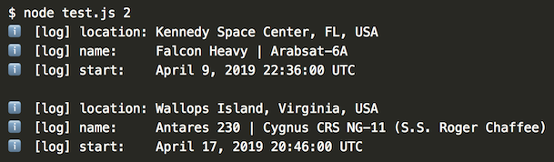

# @emit-js/emit

A javascript event emitter for a new ecosystem of observable libraries.


## Mission

We aim to define a standard, flexible API for javascript event emitting.

Using this API, **we are building an ecosystem of observable & composable libraries**.

Libraries export "emit composers" — functions that add listeners to the emitter.

Libraries should be small and universal. The emit library is less than 1 kb compressed & gzipped and works on any browser.

## Effects

Using emit reduces lines of code typically devoted to importing and instatiating code across many files.

With minimal to no code changes, users can dynamically add functionality (such as logging) to any listener.

The emit composer pattern decouples libraries at the npm dependency level. End users maintain full control over library versioning and composition.

Emit better enables library authors to flexibly degrade if users choose not to include certain components. Emit works great with dynamic imports.

## Your first observable library

Let's create the `nextLaunch` listener, which displays upcoming rocket launches:

```js
const api = "https://launchlibrary.net/1.3/launch/next"

async function nextLaunch(arg, prop, emit) {
  // HTTP request
  const { launches } = await emit.http({
    url: api + "/" + arg.count,
  })
  // Log launches
  for (launch of launches) {
    emit("log", `location: ${launch.location.name}`)
    emit("log", `name:     ${launch.name}`)
    emit("log", `start:    ${launch.windowstart}\n`)
  }
  // Return launches
  return launches
}

// Export composer
module.exports = function(emit) {
  // Attach listener
  emit.any("nextLaunch", nextLaunch)
}
```

Save the above code as `nextLaunch.js`.

## Using observable libraries

Install dependencies:

```bash
npm install --save-exact \
  @emit-js/emit \
  @emit-js/http \
  @emit-js/log
```

Let's compose our emitter and emit `nextLaunch`:

```js
// Create emitter
const emit = require("@emit-js/emit")()

// Compose emitter
require("@emit-js/http")(emit)
require("@emit-js/log")(emit)
require("./nextLaunch")(emit)

// Emit nextLaunch
;(async function() {
  await emit.nextLaunch({ count: process.argv[2] })
})()
```

Save the above code as `test.js` and run it:



Use the `LOG=debug` env var to see all events:


